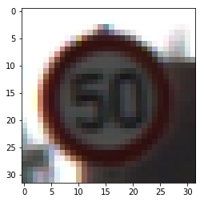
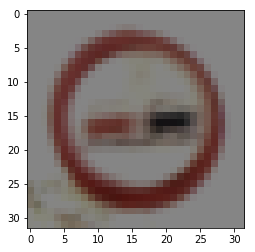
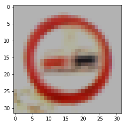
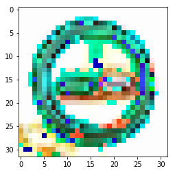
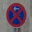

#**Traffic Sign Recognition**

##Writeup Template

###You can use this file as a template for your writeup if you want to submit it as a markdown file, but feel free to use some other method and submit a pdf if you prefer.

---

**Build a Traffic Sign Recognition Project**

The goals / steps of this project are the following:
* Load the data set (see below for links to the project data set)
* Explore, summarize and visualize the data set
* Design, train and test a model architecture
* Use the model to make predictions on new images
* Analyze the softmax probabilities of the new images
* Summarize the results with a written report

## Rubric

This is a per-point addressment of the Udacity review rubric. It's sort of like filling a form instead of writing freeform text, but I hope reviewing the document is therefore easier and more structured.

A reference to the rubric is visible here: [rubric.](https://review.udacity.com/#!/rubrics/481/view)

---

### Writeup

#### 1. Provide a Writeup that includes all the rubric points and how you addressed each one. You can submit your writeup as markdown or pdf. You can use this template as a guide for writing the report. The submission includes the project code.

Hi! Thank you for reviewing my project even though it's a few days past the deadline. I needed to add some final touches in order to be satisfied with the result.

My project is included as a zipfile and also visible on GitHub: [project](https://github.com/boxmein/CarND-Traffic-Sign-Classifier-Project/blob/master/Traffic_Sign_Classifier.ipynb)

### Data Set Summary & Exploration

In my code, each of the relevant sections have a proper heading with the same title. I won't mention this again in the below segments :)

#### 1. Provide a basic summary of the data set and identify where in your code the summary was done. In the code, the analysis should be done using python, numpy and/or pandas methods rather than hardcoding results manually.

Some simple python and Numpy functions were used to calculate statistics.

- Number of training examples = 34799
- Number of testing examples = 12630
- Image data shape = (32, 32, 3)
- Number of classes = 43

#### 2. Include an exploratory visualization of the dataset and identify where the code is in your code file.

The exploratory visualization includes a histogram showing the frequency of each class in the training set. It also shows a random sample of an image in the training set, just to know what we're dealing with.

Histogram of street sign class representation in the dataset.

Random "50 km/h" sign from the dataset

### Design and Test a Model Architecture

#### 1. Describe how, and identify where in your code, you preprocessed the image data. What tecniques were chosen and why did you choose these techniques? Consider including images showing the output of each preprocessing technique. Pre-processing refers to techniques such as converting to grayscale, normalization, etc.

My preprocessing code normalizes the image data to have every pixel value between -1 and 1. It doesn't grayscale the images, because the colors contain a lot of information as to which class they belong to. (Stop signs are red, after all!)

I preprocessed the classes to convert them to one-hot encoding, using a simple Numpy function from Stack Overflow. Sadly I haven't worked too much with Numpy so a preimplementation was the better way out here.

#### 2. Describe how, and identify where in your code, you set up training, validation and testing data. How much data was in each set? Explain what techniques were used to split the data into these sets. (OPTIONAL: As described in the "Stand Out Suggestions" part of the rubric, if you generated additional data for training, describe why you decided to generate additional data, how you generated the data, identify where in your code, and provide example images of the additional data)

I set up the data by importing it from the existing pickle files. The dataset sizes were 34799 for original training data, 4410 for original validation data and 12630 for original testing data.

The cross validation function I used simply used the entire validation set for every epoch. No splitting was needed if I used the
presplit dataset.

I augmented the training data by creating 7 images per test image, with random alterations to the luminance. The luminance augmentation source has been taken from a different project, with changes to fit in my current solution, and has been linked in the respective code cell.

My final training set had (34799 + 243593 = 278392) number of images. I did not augment my validation and test sets.

Here is an example of a few luma-augmented images:

However, I was having issues with Matplotlib displaying my images, often resulting in
colorful images like this:

#### 3. Describe, and identify where in your code, what your final model architecture looks like including model type, layers, layer sizes, connectivity, etc.) Consider including a diagram and/or table describing the final model.

My final model is a modification of the LeNet architecture, consisting of the following layers.

| Layer         		|     Description	        					|
|:---------------------:|:---------------------------------------------:|
| ## Input layer  ##	|												|
| Input         		| 32x32x3 RGB image   							|
| ## Convolution 1 ##	|												|
| 5x5x3 convolution 	| Output - 28x28x6. Stride 1, padding valid.    |
| ReLU 					| Output - same size. 							|
| Max pooling			| Output - 14x14x6. Stride 2, padding valid.	|
| ## Convolution 2 ##	|												|
| 5x5x6 convolution.	| Output - 10x10x16. Stride 1, padding valid.	|
| ReLU					| Output - same size. 							|
| Max pooling			| Output - 5x5x16. Stride 1, padding valid.		|
| ## Convolution 3 ##	|												|
| 1x1x16 convolution.	| Output - 5x5x24. Stride 1, padding valid.		|
| Dropout				| It's dropout! :D  							|
| Flatten				| Reshape into a flat list. Output - 600x1		|
| ## FC 1 ##			|												|
| Fully connected layer	| A simple fully connected layer. Output - 120x1|
| ReLU					| Output - same size. 							|
| Dropout				| It's dropout! :D  							|
| ## FC 2 ##			|												|
| Fully connected layer	| A simple fully connected layer. Output - 84x1 |
| ReLU					| Output - same size. 							|
| ## Output ##			|												|
| Output layer			| Output - 43x1.								|
| ## For training: ##   |												|
| Cross validation		| Comparing real result to classifier output	|
| Adam optimizer		| Learning rate is defined in code				|

#### 4. Describe how, and identify where in your code, you trained your model. The discussion can include the type of optimizer, the batch size, number of epochs and any hyperparameters such as learning rate.

The training code is included under the heading "Train, Validate and Test the Model", in the second
cell. The first cell contains operation definitions that don't need to be rerun when training again.

I used an Adam optimizer for training, reducing the loss cross-validating a one-hot encoded label with the model's output. I used a batch size of 512 over 40 epochs, producing an acceptable accuracy of 96%.

My learning rate is a constant 0.001, but I played around with exponential falloff. A single epoch
ran for around 10 seconds on the Floyd GPU instance.

#### 5. Describe the approach taken for finding a solution. Include in the discussion the results on the training, validation and test sets and where in the code these were calculated. Your approach may have been an iterative process, in which case, outline the steps you took to get to the final solution and why you chose those steps. Perhaps your solution involved an already well known implementation or architecture. In this case, discuss why you think the architecture is suitable for the current problem.

For accuracy calculations, I define a function evaluate() in the first cell under the heading "Train, Validate and Test the Model". In the final model after training for 40 epochs, my training set loss was 0.106, validation accuracy was 0.961 (96.1%).

I started off using the LeNet model. We had discussed it in the lessons and it was a good convolutional neural net to base the classifier on.

To run the traffic sign classifier, it needed a few modifications - namely in the shape of the output layer. It needed to output all 43 classes instead of the 10 for decimals. When running, I discovered it gave a low accuracy of 40% with decent hyperparameters, therefore it was obvious the model needed to be more complex to capture traffic signs.

I added another convolutional layer and increased the convolution's depth to allow it to learn about more features of the image. To make the model have a stronger "understanding" of the images, I applied some of the techniques learned in the lessons. I added layers of dropout and another fully connected layer. I adjusted the learning rate lower to increase the model's stability and ran it on a faster machine to allow it time to train.

### Test a Model on New Images

#### 1. Choose five German traffic signs found on the web and provide them in the report. For each image, discuss what quality or qualities might be difficult to classify.

Here are five German traffic signs that I found on the web:

The Alert Sign showed the lowest confidence when training. I assume it's because of the
plaque under it confusing the model's predictions based on shape.

#### 2. Discuss the model's predictions on these new traffic signs and compare the results to predicting on the test set. Identify where in your code predictions were made. At a minimum, discuss what the predictions were, the accuracy on these new predictions, and compare the accuracy to the accuracy on the test set (OPTIONAL: Discuss the results in more detail as described in the "Stand Out Suggestions" part of the rubric).

Discussed in the next section.

#### 3. Describe how certain the model is when predicting on each of the five new images by looking at the softmax probabilities for each prediction and identify where in your code softmax probabilities were outputted. Provide the top 5 softmax probabilities for each image along with the sign type of each probability. (OPTIONAL: as described in the "Stand Out Suggestions" part of the rubric, visualizations can also be provided such as bar charts)

The prediction code is run under "Predict the Sign Type for Each Image", by running
the same network with data loaded from file.

The predictions were made on each image and the results are shown below. The model has
correct results and has very high confidence for each of the sign types.

| Image                 |     Prediction	                              |
|:---------------------:|:---------------------------------------------:|
| Stop Sign 1           | 14 (Stop sign) - 100% confidence              |
| Stop Sign 2           | 14 (Stop sign) - 100% confidence              |
| Alert Sign/General H. | 18 (General hazard) - 99.9998% confidence     |
| Frost Hazard          | 11 (Right-of-way at next..) - 99.9999% conf.  |
| No Parking and <-     | 6  (end of speed limit) - 43.53% confidence   |
 
The model was able to correctly guess 3 of the 5 traffic signs, which gives an accuracy of 60%. This is lower than the accuracy on the validation set, worse than desired. It seems the model's accuracy depends heavily on the quality of the images and any additional markings inside the model.

It was a surprise to me that the frost hazard image was classified wrong, since it is a very clear front-facing image.

I had a lot of fun seeing the model's feature maps, since it offered a kind of insight into
how the model makes its predictions.

Thank you again for reviewing my project!